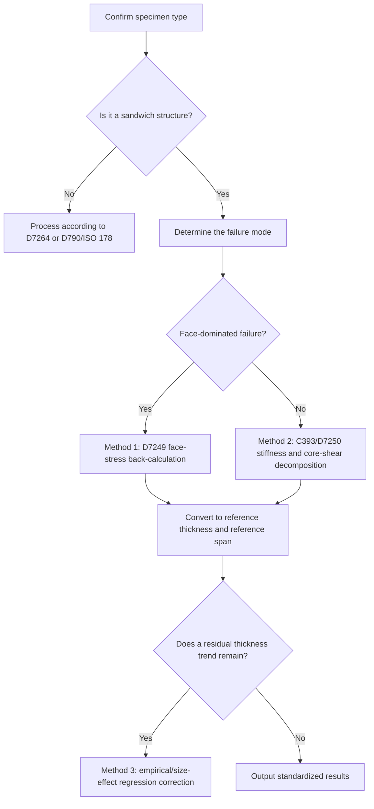

# Research on Thickness-Correction Methods for Standardizing Flexural-Test Results of Carbon-Fiber-Reinforced Sandwich Structures

[English](thickness-normalization-research.md) | [Chinese](../zh/thickness-normalization-research.md)

## Executive Summary

For sandwich structures consisting of fiber-reinforced faces and a core, **differences in final formed thickness can significantly change the apparent flexural strength and modulus obtained from general-purpose bending formulas**. This does not necessarily mean that the material itself has changed. The neutral-axis position, lever arm from each face to the neutral axis, contribution of core shear deformation, span-to-thickness ratio, and large-deflection or machine-compliance correction path all vary with thickness. Consequently, treating the nominal flexural stress or modulus from ASTM D790, ISO 178, or ASTM D7264 as a material constant that can be compared directly across thicknesses often mixes geometric and material effects in sandwich structures. ASTM D790 itself states that, for highly anisotropic laminates, the simple-beam formula provides only an **apparent strength** based on a homogeneous-beam assumption and that the result strongly depends on the layup. ASTM D7264 likewise states that flexural properties vary with specimen thickness, compression face, environment, and layup. ISO 178 notes that its formulas assume linear elasticity and small deflection and requires either compliance correction or direct deflection measurement for modulus determination. citeturn7view3turn36view0turn9view5turn13search4turn39search0

For these materials, **the most robust thickness-standardization strategy is not to force a comparison through nominal stress for a solid rectangular beam**, but to convert the test results into metrics closer to intrinsic structural quantities. For strength, the preferred approach is to back-calculate the **ultimate face stress** according to ASTM D7249, because it explicitly includes face thickness, core thickness, and support/loading span and therefore relates the same face material to different geometries. For stiffness, the preferred approach is to separate the **effective flexural rigidity (D)** and **transverse shear rigidity (U)** according to ASTM D7250, then use sandwich-beam theory to back-calculate the face modulus and core shear modulus and reconstruct the response for a common reference geometry. Only when historical data contain peak load and total thickness but lack face thickness or strain data should an empirical power-law or Bažant-type size-effect regression be used as a fallback thickness correction. citeturn38search0turn25view1turn25view4turn24search1turn24search9turn22search1

This report ultimately recommends a layered workflow. The **preferred workflow** is “D7249 face-stress standardization + D7250 stiffness decomposition.” The **alternative workflow** is “simplified sandwich-beam model + reference-thickness reconstruction.” The **fallback workflow** is “empirical thickness regression within one process family.” If one method must provide the simplest practical result that best removes differences in formed thickness, the final report should use ultimate face stress (sigma_{f,u}), reconstructed peak load for a reference geometry (P_{u,\mathrm{ref}}), and the reconstructed stiffness curve for that geometry as its primary metrics. D790/ISO 178-style nominal flexural strength should be retained only as an apparent value in an appendix. citeturn38search0turn25view1turn36view0turn14search0

## Problem Background and Standards Boundaries

A typical sandwich structure consists of two high-modulus faces separated by a low-density core. Under bending, the faces primarily carry tensile and compressive normal stress, while the core maintains face separation and carries shear. The high specific stiffness and strength of this structure therefore arise from geometric coupling between thin, strong faces and a thick, lightweight core, not from a homogeneous section that can be represented by a solid-beam formula. MIT sandwich-beam notes and Allen's classic text both emphasize that total sandwich-beam deflection normally must be decomposed into bending deflection and core-shear deflection. In a typical sandwich, (E_c \ll E_f) and (c \gg t), so a thickness change modifies both the bending lever arm and the shear contribution. citeturn20view1turn20view0

The user's concern—that differences in final formed thickness affect measured flexural strength and modulus—is directly reflected in the standards. ISO 178 states that results obtained with different dimensions or specimen-preparation conditions may not be comparable. It specifically notes that, for semicrystalline polymers, the thickness of the surface orientation layer, which depends on molding conditions, can affect flexural properties. ASTM D7264 states that flexural properties are affected by specimen thickness, the face in compression, environment, and strain rate and requires equivalent parameters when multiple data sets are compared. For sandwich structures, ASTM D7249 further identifies face thickness, core-cell geometry, and face flatness as factors that affect face strength. D7250 restricts its stiffness decomposition to a linear load-displacement response. citeturn11view0turn36view0turn38search0turn5search1

The standards boundaries must therefore be defined first. ASTM D790 and ISO 178 mainly address nominal three-point flexural properties of unreinforced or reinforced plastics. ASTM D7264 addresses continuous-fiber polymer-matrix composite laminates. Standards **directly intended for sandwich structures** are ASTM D7249 for face properties, ASTM C393/C393M for core-shear or core-to-face-bond-dominated beam bending, and ASTM D7250/D7250M for determining flexural and shear rigidities of sandwich beams from bending tests. Although ISO 14125 is not one of the user's core named standards, it is the corresponding ISO standard for fiber-reinforced plastic composites and explicitly describes itself as based on ISO 178 but extended to FRP composites and three- or four-point bending, making it a useful supplementary comparison. citeturn39search1turn13search3turn38search2turn38search0turn38search1turn5search1turn32search0turn33view0

Most complete ASTM and ISO standards are paywalled. This comparison is based on official summaries and catalog pages, public previews and samples, and primary academic literature or textbooks. A compliant laboratory report must still cite the formally purchased standard text and its declared edition. citeturn39search8turn38search10turn13search3turn39search0

## Comparison of Relevant Standards

The following table asks not which standard is more authoritative, but which standard most closely addresses the thickness-bias problem at hand.

| Standard | Primary subject | Typical loading | Key thickness/span provisions | Calculation focus | Relevance to thickness standardization |
|---|---|---|---|---|---|
| ASTM D790 | Unreinforced/reinforced plastics and some high-modulus composites | Three-point bending | Default span-to-thickness ratio 16:1; may increase to 32:1 or 40:1 for highly anisotropic laminates and to 60:1 for modulus; specimen thickness depends on material class | Nominal outer-fiber stress, strain, and flexural modulus; correction formula for large span-to-thickness ratios or large deflection | Suitable for **apparent values**; not suitable for directly removing thickness bias in sandwich structures |
| ISO 178 | Rigid and semi-rigid plastics | Three-point bending | Preferred specimen 80×10×4 mm and preferred (L/h=16); formulas assume linear elasticity and small deflection; modulus measurement requires compliance correction or a deflectometer | Nominal flexural stress, strain, and modulus | Useful for plastics quality control; not the first choice for sandwich or FRP face structures |
| ASTM D7264 | Continuous-fiber polymer-matrix composite laminates | Three- or four-point bending | Standard span-to-thickness ratio 32:1; nominal thickness 4 mm and width 13 mm; 16:1, 20:1, 40:1, and 60:1 may be used, but data from different ratios cannot be compared directly | Long-beam strength, stiffness, and load-displacement response | Better than D790 for CFRP laminates, but still primarily a **laminate** rather than sandwich method |
| ASTM D7249/D7249M | Face properties of sandwich structures | Primarily long-beam four-point loading; the formulas also allow the (L=0) case | Empirical requirements include (L/d>20) and (t/c<0.1); formulas explicitly include face and core thicknesses | **Ultimate face stress**, face chord modulus, and sandwich flexural rigidity | **Preferred for strength standardization**, especially for FRP faces with a sandwich core |
| ASTM C393/C393M | Core-shear and core-to-face-bond-dominated behavior of sandwich structures | Beam bending | The standard configuration is commonly three-point loading, with nonstandard four-point configurations also listed; results are used with D7250 | Core shear strength, core-to-face bond, and load-displacement response | Identifies whether failure is governed by the **core or interface** rather than the faces |
| ASTM D7250/D7250M | Flexural and shear rigidity of sandwich beams | Based on C393 or D7249 results | Solves the deflection equation using two loading configurations or two spans; applies only to the linear load-displacement region | **Flexural rigidity (D)**, transverse shear rigidity (U), and core shear modulus (G_c) | **Preferred for modulus/stiffness standardization** |
| ISO 14125 | Fiber-reinforced plastic composites | Three- or four-point bending | Specifies span-to-thickness ratios for material classes; FRP, especially carbon-fiber systems, uses larger outer span-to-thickness ratios, and the inner four-point span is one third of the outer span | Flexural strength and modulus of FRP | Useful as an ISO-side supplement to ASTM D7264 |

The statements in the table about scope, dimensions, span-to-thickness ratio, loading configuration, and non-comparability are compiled from official ASTM/ISO summary pages, public previews, and sample documents. The essential distinctions are D790's warning about apparent results, ISO 178's small-deflection and compliance-correction requirements, D7264's 32:1 long-beam approach, and the specific focus of D7249/D7250 on sandwich structures. citeturn39search1turn39search0turn10view0turn9view5turn13search4turn38search2turn16view0turn36view0turn38search0turn18view0turn25view1turn25view5turn38search1turn33view0turn34view0

For the user's application, the conclusion is clear: **if the specimen is a true sandwich rather than a solid CFRP laminate, D790, ISO 178, and D7264 provide only forms of apparent flexural characterization and do not inherently remove thickness differences. Decoupling the thickness effect requires the D7249 + D7250 sandwich framework.** citeturn38search0turn5search1turn38search2turn39search1

## Theoretical Basis

### Flexural Mechanics and Nominal Formulas

For a simply supported, homogeneous, linearly elastic beam with a rectangular cross-section, the maximum bending moment in three-point bending is (M_{\max}=PL/4). The nominal outer-fiber stress is therefore:

\[
\sigma = \frac{M c}{I}=\frac{3PL}{2bd^2}.
\]

This is the nominal-stress expression in ASTM D790. Its corresponding nominal strain is:

\[
\varepsilon=\frac{6Dd}{L^2},
\]

and the flexural modulus is obtained from the initial slope (m):

\[
E_B=\frac{L^3 m}{4 b d^3}.
\]

ASTM D790 also provides an approximate correction for large span-to-thickness ratios and high deflections. citeturn7view3turn8view2turn29view0

These formulas assume that the section can be approximated by simple-beam theory with a homogeneous cross-section and negligible shear effects. ASTM D790 explicitly states that, for highly orthotropic laminates, the maximum stress may not occur at the outer surface. If the simple-beam formula is nevertheless used, it gives an **apparent strength** based on homogeneous-beam theory that strongly depends on the stacking sequence. ASTM D7264 likewise notes that its calculations are based on beam theory, while an actual specimen generally behaves more like a plate. This difference can be significant for laminates containing many (pm45^\circ) plies. citeturn7view3turn36view0

### Laminate Theory and Thickness Dependence

Classical laminate theory relates in-plane forces (N) and moments (M) to mid-plane strain and curvature through the (A), (B), and (D) matrices. The (D) matrix represents bending stiffness. For a laminate symmetric about its mid-plane, (B=0), eliminating membrane-bending coupling. Therefore, **the same material with a different total thickness or stacking distribution** has a different flexural response through its (D) matrix and neutral-axis distribution. Jones's classic textbook, TU Delft's CLT course, and open lecture notes all treat this as a central point in laminate bending analysis. citeturn37search1turn37search4turn37search7turn37search0

Thickness effects in composite flexure are more than incomplete dimensional normalization. Research by Bažant and others on the size effect in flexural strength of fiber-composite laminates shows that nominal strength can vary systematically with structural size. In laminates and sandwich structures, this behavior is often associated with quasibrittle fracture zones, energy release, and statistical size effects rather than simple small-sample scatter. More recent work by Hu and others uses CFRP laminate flexural tests to show that thickness dependence is related to ply thickness and proposes a combined formula for back-calculating a thickness-independent intrinsic tensile strength. They also report that, for typical CFRP ply thicknesses of approximately 120–130 μm, the nominal 4 mm specimen recommended by ASTM D7264 can substantially reduce the thickness effect. citeturn24search1turn24search9turn22search1turn22search3

### Sandwich-Beam Theory and the Effect of Total Thickness

The key distinction for a sandwich beam is that its total deflection is not a single bending deflection but:

\[
\Delta=\Delta_b+\Delta_s.
\]

The form in the MIT sandwich-beam notes follows the same principle as the standard deflection equation in ASTM D7250. The former separates effective bending stiffness ((EI)_{eq}) from core shear stiffness ((AG)_{eq}), while the latter expresses them as sandwich-beam flexural rigidity (D) and transverse shear rigidity (U):

\[
\Delta = \frac{P(2S^3-3SL^2+L^3)}{96D}+\frac{P(S-L)}{4U}.
\]

For a typical sandwich with (E_c\ll E_f) and (c\gg t), the effective flexural rigidity can be approximated as:

\[
D \approx \frac{E_f b t(c+t)^2}{2}+\frac{E_c b c^3}{12}
\approx \frac{E_f b t c^2}{2},
\]

which shows that **even when the face material is unchanged, any change in face thickness (t), core thickness (c), or total thickness (d=c+2t) significantly changes the flexural rigidity**. At the same time, inadequate core shear rigidity causes the apparent modulus to be underestimated. citeturn25view1turn25view2turn20view1

For strength of FRP-faced sandwich structures, the ASTM D7249 ultimate-face-stress formula simplifies for equal faces (t_1=t_2=t) to:

\[
\sigma_{f,u}=\frac{P_{\max}(S-L)}{2(d+c)bt}.
\]

The same ultimate face stress (sigma_{f,u}) therefore corresponds to different peak loads (P_{\max}) for different values of (d,c,t,S,L). Substitution into the D790 nominal three-point stress formula produces an important result:

\[
\sigma_{\mathrm{app}}=\frac{3PS}{2bd^2}
=\frac{3\sigma_{f,u}t(d+c)}{d^2}
\quad (L=0).
\]

For a symmetric sandwich with (c=d-2t):

\[
\sigma_{\mathrm{app}}=\frac{6\sigma_{f,u}t(d-t)}{d^2}.
\]

In other words, **even when the true ultimate face stress is unchanged, changing the total thickness causes the “flexural strength” calculated with a solid-beam nominal formula to drift systematically.** This is exactly the thickness bias that must be removed. These relationships follow directly from combining the face-stress expression in ASTM D7249 with the nominal-stress expression in ASTM D790. citeturn27view3turn29view0

## Evaluation of Thickness-Normalization Methods

### Method Overview and Applicability

| Method | Core principle | Representative formula/standard | Advantages | Limitations | Suitability for this problem |
|---|---|---|---|---|---|
| Section-modulus normalization | Treat the specimen as a homogeneous rectangular beam and use (M/Z) or D790/ISO 178 nominal stress | D790, ISO 178 | Simple and common in historical data | Does not distinguish faces from core; mixes thickness effects into the result | Low |
| Face-stress normalization | Use D7249 to back-calculate the actual tensile/compressive stress in the FRP faces | D7249 Eq. 4 | Directly addresses face failure in sandwich structures and explicitly represents geometric effects | Requires face and core thicknesses; failure must truly occur in the face | Very high |
| Effective flexural-rigidity (D) / shear-rigidity (U) normalization | Decompose total deflection into bending and shear, then reconstruct a reference geometry | D7250 + sandwich-beam theory | Best suited to standardizing modulus and the complete load-displacement curve | Requires more inputs; preferably two loading configurations/spans or known material parameters | Very high |
| Area/volume/mass normalization | Normalize specific strength, specific stiffness, or areal density | Common in lightweight structural evaluation | Useful for comparing design efficiency | Does not remove thickness bias from the test | Medium-low |
| Power-law thickness correction | Use (y=a h^{-n}) or (y=y_\infty+a h^{-n}) | Empirical regression | Easy to implement and compatible with historical databases | Highly specific to the process, material, and thickness range | Medium |
| Bažant/size-effect correction | Correct nominal strength with a quasibrittle size-effect law | Size-effect literature | Has a strong fracture-mechanics basis | Requires the same failure mechanism, a sufficient thickness range, and adequate fit quality | Medium |
| Finite-element calibration factor | Use FE to convert measured geometry to reference geometry and close the loop with a correction factor | FE + experimental calibration | Suitable for complex cells, local indentation, and interface debonding | High modeling cost and low portability | Medium-high |

The suitability ratings are based on the direct treatment of sandwich faces and stiffness decomposition in ASTM D7249/D7250, the apparent nominal-formula nature of ASTM D790/D7264/ISO 178, and literature discussions of thickness dependence in composite and sandwich structures. citeturn38search0turn25view1turn39search1turn36view0turn24search1turn24search9turn23search5

### Detailed Evaluation of the Methods

**Section-modulus normalization** is already embedded in the nominal-stress calculations of D790, ISO 178, and D7264. It is meaningful for homogeneous solid beams and often adequate for single-material laminates, but it is insufficient for sandwich structures. The faces, not the full thickness, are the principal load-bearing layers, and the core introduces significant shear deformation. The true strength of one face material therefore maps to different apparent nominal strengths. ASTM D790 and D7264 both state that laminate or composite results are affected by thickness, layup, span-to-thickness ratio, and shear. This method can serve only as a minimum cleanup step for historical data, not as the principal final standardization method. citeturn7view3turn36view0turn39search0

**Face-stress normalization** is the strongest strength-correction method for this problem. As long as the primary failure mode is tensile face fracture, compressive crushing, or local face instability rather than core shear or interface debonding, the peak load can be converted into ultimate face stress and then into a common reference thickness and span. This explicitly places the total-thickness change in the formula and most directly removes geometric amplification or reduction caused by differences in formed thickness. Its limitation is that (t_1,t_2,c,d,S,L) must be known and the failure mode must first be confirmed as face-dominated. citeturn27view3turn18view0turn38search0

**Effective flexural-rigidity (D) / shear-rigidity (U) standardization** is preferred for modulus and stiffness. Unlike an approach based only on peak load, it uses the linear segment of the load-displacement curve to separate geometrically amplified bending rigidity from core shear rigidity, back-calculate the face modulus (E_f) and core shear modulus (G_c), and finally reconstruct every specimen for a common reference geometry. This is particularly valuable for specimens with different final thicknesses but nominally the same formulation and layup, because it preserves the actual mechanical roles in the sandwich. Its principal limitation is the need for two spans or loading configurations, or additional material parameters, and the standard explicitly requires a linear load-displacement response. citeturn25view1turn25view4turn20view1

**Power-law correction, the Bažant size-effect law, and Hu's thickness-effect model** are more suitable as residual corrections or compatibility layers for historical databases than as replacements for structural-mechanics normalization. They generally apply within one process window, failure mode, and thickness range. Changes in material system, layup, core geometry, or failure mechanism can invalidate the fitted coefficients. Bažant's framework emphasizes systematic size effects caused by quasibrittle failure in composite and sandwich structures. Hu and others show that CFRP thickness effects are related to ply thickness and can be weakened in typical D7264 specimens approximately 4 mm thick. These findings support empirical or fracture-based regression, but only in the sequence **first normalize the structure, then check for a residual thickness trend**. citeturn24search1turn24search9turn22search1turn22search3

## Recommended Standardization Workflow

### Workflow Overview

This path follows the ASTM framework of treating sandwich faces, cores, and stiffness separately. It is also compatible with ISO/ASTM requirements for span-to-thickness ratio, compliance correction, and failure-mode control. citeturn38search0turn38search1turn5search1turn33view0

### Method 1

The **objective** is to convert thickness-dependent peak load (P_{\max}) into the more intrinsic ultimate face stress (sigma_{f,u}), then convert it to a common reference thickness. For a sandwich beam with equal faces and total thickness (d=c+2t), the D7249 face-stress formula can be written as:

\[
\sigma_{f,u}=\frac{P_{\max}(S-L)}{2(d+c)bt},
\]

where (L=0) for three-point bending. After selecting the reference geometry ((d_{\mathrm{ref}},c_{\mathrm{ref}},t_{\mathrm{ref}},S_{\mathrm{ref}},L_{\mathrm{ref}})):

\[
P_{\max,\mathrm{ref}}=
\frac{2\sigma_{f,u}(d_{\mathrm{ref}}+c_{\mathrm{ref}})b_{\mathrm{ref}}t_{\mathrm{ref}}}
{S_{\mathrm{ref}}-L_{\mathrm{ref}}}.
\]

If the apparent D790 strength in legacy data also needs correction, three-point bending gives:

\[
\sigma_{\mathrm{app}}=
\frac{3PS}{2bd^2}
=
\frac{3\sigma_{f,u}t(d+c)}{d^2},
\]

showing that the same (sigma_{f,u}) maps to a different (sigma_{\mathrm{app}}) when (d) changes. citeturn27view3turn29view0

Required inputs are (b,d,t_1,t_2,c,S,L,P_{\max}), the identified failure mode, and information about the compression and tension faces. If (t_1,t_2) are not provided, D7249 explicitly allows the test requester to specify measured or nominal thickness. For secondarily bonded faces, thickness should be measured before bonding where possible. For co-cured faces, nominal ply thickness multiplied by the number of plies is commonly used. If (c) is not measured directly, calculate (c=d-t_1-t_2). If the compression and tension faces have unequal thicknesses, calculate (sigma_{f1,u}) and (sigma_{f2,u}) separately. citeturn18view1turn18view3turn38search0

The three principal error sources are face-thickness measurement, changes in effective span caused by local indentation or rolling supports, and misclassification of the failure mode. If the specimen first fails by core shear or core-to-face debonding, this workflow should not be the primary result. D7249 and C393 both treat failure identification, span, and the distinction between face and core failure modes as essential. citeturn17view1turn18view0turn38search1

### Method 2

The **objective** is to convert the load-displacement curve into stiffness parameters separated from geometry and then reconstruct a common reference thickness. The general ASTM D7250 equation is:

\[
\Delta = \frac{P(2S^3-3SL^2+L^3)}{96D}+\frac{P(S-L)}{4U},
\]

where (D) is sandwich-beam flexural rigidity and (U) is transverse shear rigidity. The core shear modulus is:

\[
G_c=\frac{U(d-2t)}{b(d-t)^2}.
\]

For a symmetric sandwich with thin faces and a weak core, sandwich-beam theory can be approximated by:

\[
D \approx \frac{E_f b t(c+t)^2}{2}+\frac{E_c b c^3}{12},
\qquad
U \approx \frac{G_c b(d-t)^2}{d-2t}.
\]

After obtaining (E_f) and (G_c), substitute the reference geometry ((d_{\mathrm{ref}},t_{\mathrm{ref}},c_{\mathrm{ref}})) to calculate (D_{\mathrm{ref}}) and (U_{\mathrm{ref}}), then reconstruct the entire curve for the reference geometry:

\[
\Delta_{\mathrm{ref}}(P)=
\frac{P(2S_{\mathrm{ref}}^3-3S_{\mathrm{ref}}L_{\mathrm{ref}}^2+L_{\mathrm{ref}}^3)}{96D_{\mathrm{ref}}}
+\frac{P(S_{\mathrm{ref}}-L_{\mathrm{ref}})}{4U_{\mathrm{ref}}}.
\]

citeturn25view1turn25view2turn20view1

This method is best suited to two situations. First, the experiment includes two spans, two loading configurations, or two linear flexural tests of the same specimen. Second, independent face modulus, core modulus, and core shear-modulus data are available and specimens of different thicknesses need to be reconstructed at one reference thickness and span. D7250 was established specifically for obtaining (D) and (U) from the deflection equation in these situations. citeturn25view4turn5search1

Required inputs are at least one linear load-displacement segment, (b,d,t,c,S,L), and additional information sufficient to determine (D,U). If (E_f,E_c,G_c) are not specified, they can be back-calculated from two loading configurations. One loading configuration without a known face modulus is, strictly speaking, insufficient to separate bending and shear contributions uniquely. If the equipment records only crosshead displacement and has no independent deflectometer, ISO 178 requires either compliance correction or direct deflection measurement for modulus determination. D790 allows crosshead displacement to be reported, but requires the measurement method to be identified and notes that the two methods produce different results. citeturn9view5turn8view2turn13search4

The dominant error source is normally not force but the deflection measurement chain: machine compliance, support rolling, initial seating, local indentation, and selection of the linear segment. For specimens with small thickness differences, these errors can exceed the true thickness effect. Method 2 should therefore report the raw curve, fitted linear-segment interval, compliance-correction method, and interval estimates for (D,U,G_c). citeturn25view4turn8view2turn9view5

### Method 3

When a historical database contains only total thickness and peak load/apparent strength, with no (t_1,t_2,c) or deflection chain, only an empirical thickness correction is possible. The most common form is a power law:

\[
y(h)=a h^{-n}
\quad\text{or}\quad
y(h)=y_\infty+a h^{-n},
\]

and an observation at thickness (h_i) is converted to reference thickness (h_{\mathrm{ref}}) using:

\[
y_{\mathrm{ref},i}=y_i\frac{f(h_{\mathrm{ref}})}{f(h_i)}.
\]

If the governing mechanism is suspected to be quasibrittle fracture or crack initiation, a Bažant-type size-effect expression can be used, for example:

\[
\sigma_N(h)=\frac{B}{\sqrt{1+h/h_0}},
\]

followed by the same reference-thickness conversion. citeturn24search1turn24search9turn24search16

This method requires three conditions: the same process window, the same failure mode, and the same span-to-thickness ratio/environment/rate system. Otherwise, the regression coefficient mixes process, rate, hygrothermal, and thickness differences into a false thickness exponent. Research by Hu and others on composite laminates shows that the thickness effect is closely related to individual ply thickness, which also means that an empirical correction cannot be transferred mechanically across material systems. citeturn22search1turn22search3turn36view0

If Method 3 is included in a formal report, it should be positioned as a residual model. First apply Method 1 or 2 for structural-mechanics correction, then check whether the normalized results still have a systematic slope with thickness. Only when the residual remains significant should it be fitted with a power law or Bažant model. This is more robust than replacing structural analysis directly with regression. citeturn24search9turn25view1turn38search0

## Example Calculation and Templates

### Numerical Example

The following is a **reproducible example intended only to demonstrate the effect of the formulas**. Assume that two specimen groups have exactly the same face material, both with true ultimate face stress (sigma_{f,u}=420) MPa, width (b=25) mm, and face thickness (t=1) mm, and that both are tested in three-point bending at the same span-to-thickness ratio (S/d=20). Specimen A has total thickness (d=12) mm and core thickness (c=10) mm. Specimen B has total thickness (d=14) mm and core thickness (c=12) mm. Back-calculation from D7249 gives the peak load:

\[
P_{\max}= \frac{2\sigma_{f,u}(d+c)bt}{S}.
\]

Thus, (P_{\max}=1925) N for A and (P_{\max}=1950) N for B. The peak loads appear nearly identical, but the D790 nominal-stress formula gives an apparent flexural strength of approximately 192.5 MPa for A and 167.1 MPa for B. In other words, **although the true face strength is the same, the apparent nominal strength decreases by approximately 13% solely because the thickness differs**. Back-calculation with D7249 returns both specimens to 420 MPa. This is the simplest illustration of how thickness bias can be confused with a true material change. citeturn27view3turn29view0

| Specimen | (d) mm | (c) mm | (t) mm | (S) mm | (P_{\max}) N | D790 apparent strength MPa | D7249 ultimate face stress MPa |
|---|---:|---:|---:|---:|---:|---:|---:|
| A | 12 | 10 | 1 | 240 | 1925 | 192.5 | 420 |
| B | 14 | 12 | 1 | 280 | 1950 | 167.1 | 420 |

The peak loads in the table are back-calculated from the D7249 relationship, while apparent strength is calculated from the D790 nominal-stress expression. The values do not represent experimentally measured material differences; they are the apparent differences produced when the same true face strength is mapped to geometries of different thickness. citeturn27view3turn29view0

For stiffness, assume that both groups share face modulus (E_f=70) GPa, core elastic modulus (E_c=100) MPa, and core shear modulus (G_c=40) MPa. The sandwich-beam approximation then gives (D\approx1.06\times10^8) N·mm(^2) and (U\approx1.21\times10^4) N for A, and (D\approx1.48\times10^8) N·mm(^2) and (U\approx1.41\times10^4) N for B. The thicker specimen has greater raw stiffness as a geometric necessity. If B is converted back to A's reference geometry, however, the reconstructed curve converges with A. Therefore, **thickness standardization of modulus or stiffness should not compare (P/\Delta) directly; it should first decouple (D) and (U), then project them onto one reference geometry.** citeturn25view1turn20view1

### Inputs and Treatment of Missing Data

| Input | Required for Method 1? | Required for Method 2? | Recommendation if missing |
|---|---|---|---|
| Total thickness (d), width (b) | Required | Required | Must be measured at no fewer than three points and averaged; this is the minimum requirement for all methods |
| Face thicknesses (t_1,t_2) | Strongly required | Strongly required | Measure secondarily bonded faces before bonding where possible; for co-cured faces, use nominal ply thickness × number of plies and perform a ±5–10% sensitivity analysis |
| Core thickness (c) | Required | Required | Calculate (c=d-t_1-t_2); propagate uncertainty when the face-thickness measurement error is large |
| Support span (S), loading span (L) | Required | Required | Must come from measured fixture values; data with different span-to-thickness ratios cannot be pooled for comparison |
| Peak load (P_{\max}) | Required | Alternative | If only peak load is available, Method 1 can still be performed |
| Load-displacement curve | Recommended | Core requirement | Without a curve, (D) and (U) cannot be separated reliably |
| Face/core material parameters (E_f,E_c,G_c) | Not always | Depends on workflow | If unavailable, back-calculate from two loading configurations or external tests; supplier data are estimates only |
| Failure mode | Core requirement | Core requirement | If the primary failure is not in the faces, use a core- or interface-dominated workflow |
| Machine compliance/deflection measurement method | Recommended | Core requirement | Modulus analysis must state whether compliance correction or a deflectometer was used |

This treatment is consistent with D7249 guidance on face-thickness selection, ISO 178 requirements for compliance correction in modulus measurement, and D7250's dependence on a linear-segment deflection equation. citeturn18view1turn9view5turn25view4

### Template Files

Templates generated in an earlier conversation have not yet been added to this repository. When added, they should be placed consistently in `tests/flexural/forms/templates/` with the following stable filenames:

- `sandwich_flexure_normalization_template.xlsx`
- `specimen_summary_template.csv`
- `raw_curve_template.csv`

In the template, the `Calc_Strength` worksheet corresponds to Method 1, `Calc_Stiffness` to Method 2, `Empirical_Fit` to Method 3, and `Plot_Guide` lists the recommended plotting fields.

### Recommended Plots

At least three plot types should be produced. First, a **load-displacement curve** is needed to identify the linear segment, machine-compliance effects, and sudden failure. Second, a **pre-normalization strength-versus-thickness scatter plot** should use total thickness on the horizontal axis and D790/D7264-style apparent strength on the vertical axis. Third, a **post-normalization face-stress-versus-thickness scatter plot** should retain total thickness on the horizontal axis but use ultimate face stress back-calculated with D7249 on the vertical axis. If the method is effective, the second plot commonly has a pronounced slope while the third should converge substantially. For stiffness, a comparison between the reconstructed reference-geometry curve and the measured curve is also recommended. citeturn25view1turn38search0turn29view0

## Finite-Element Calibration and Implementation Recommendations

### When Finite Elements Are Warranted

Analytical formulas alone are often insufficient when the specimen has a discrete honeycomb, corrugated, or lattice core rather than continuous homogeneous foam or wood; thick faces, local reinforcement, or an asymmetric layup rather than thin symmetric faces; clear indentation, local buckling, face-core debonding, core crushing, or coupled failure modes under the loading nose; or a laboratory requirement to convert multiple thickness specifications to one reference geometry for engineering release. FE calibration can then include local contact, face-core interfaces, and nonuniform stress fields. Recent sandwich-flexure literature commonly combines experiment, analytical modeling, and FE, indicating that this is a standard approach for complex sandwich structures rather than unnecessary complexity. citeturn31search11turn31search16turn23search10

### Modeling Steps and Boundary Conditions

Boundary conditions must first match the declared standard exactly: support span, loading span, loading/support-nose radii, three- or four-point loading, use of pressure pads, and rolling or rotating supports must correspond to the test fixture. ASTM D7264, D7249, and ISO 178 specify support/loading-nose radii, span definitions, and deflection-measurement positions. The FE loading noses and supports should therefore be modeled as rigid analytical surfaces, with radii, spans, and contact positions taken directly from measured fixture parameters. Apply displacement-controlled loading and output the reaction-force/displacement curve and midspan deflection. citeturn36view0turn17view1turn9view5

If the objective is **geometric correction rather than failure prediction**, the first model can be linearly elastic: use orthotropic laminate properties for the faces, isotropic or orthotropic solids for the core, and an initially perfectly bonded interface. Calibrate (E_f,G_c), or interface stiffness from the measured small-deflection linear segment. If failure and peak load are also required, progressively introduce a Hashin-, Puck-, or Tsai-Wu-type face failure criterion, a core crushing or shear-yield model, and an interface cohesive-zone or contact-debonding model. Model complexity should follow the observed failure mode rather than being enabled all at once. Recent numerical studies of three-point bending commonly use experiments to identify the primary failure mode and then add the corresponding damage mechanism progressively in FE. citeturn31search11turn31search16turn24search15

### Mesh and Material-Model Recommendations

For relatively simple geometries, a common approach uses shell elements for the faces, solid elements for the core, and tie/coupling or cohesive behavior at the face-core interface. If through-thickness stress, local indentation, or interface stress is important, solid elements for both faces and core are more robust. In recent Abaqus studies of three-point bending, eight-node reduced-integration solid elements such as C3D8R are a common choice and are validated against experiments. There is no single standard mesh size. Locally refine the loading-nose contact zone, face-core interface, and regions with through-thickness stress gradients until the peak reaction force and midspan deflection are mesh-insensitive. citeturn31search6turn31search11

If CLT or laminate information is available for the faces, enter the engineering constants and layup of each ply rather than assigning one equivalent isotropic face. For a foam or honeycomb core, at least distinguish elastic shear modulus from compressive modulus rather than providing only one (E) value. If core (G_c) data are unavailable, they can be back-calculated with D7250 or FE. This is more representative of flexural loading than blindly using the “compressive modulus” from a supplier's marketing page. citeturn25view1turn20view1turn26search0

### Final Recommendation and Uncertainty Assessment

Considering standards applicability, physical meaning, implementation cost, and the ability to remove thickness differences, this report makes the following final recommendation. Use ultimate face stress (sigma_{f,u}) under the ASTM D7249 framework as the **primary strength metric**. Use (D), (U), (G_c), and the reconstructed reference-geometry curve under the ASTM D7250 framework as the **primary stiffness metrics**. Retain **D790/ISO 178/D7264 nominal values** only as supplementary apparent metrics for compatibility with historical databases. If a multi-thickness historical database is incomplete, add empirical thickness regression as a residual-correction layer rather than making it the primary method. citeturn38search0turn25view1turn38search2turn39search1

The recommended implementation sequence is to standardize the recording of geometry and fixture parameters; classify specimens by failure mode as face-dominated or core/interface-dominated; back-calculate face stress for the former and decompose (D/U) in the linear segment; reconstruct every specimen at the same reference thickness, span-to-thickness ratio, and loading configuration; and finally check whether a thickness slope remains in the normalized results. If it does, apply an empirical regression correction limited to the current material-process family. citeturn38search0turn38search1turn25view4

Uncertainty should be reported for at least five factors: geometry measurement, especially face thickness; force/displacement and machine-compliance correction; consistency of failure-mode identification; equivalence of environment and strain rate; and sensitivity to the selected reference geometry. When only nominal ply thickness is used rather than a precise face measurement, perform at least a ±5–10% sensitivity analysis. When core (G_c) is unknown and obtained by back-calculation, report a parameter interval rather than a single value. Only then can thickness-standardized results distinguish differences in formed thickness from changes in material performance. citeturn18view1turn9view5turn25view4turn39search0
