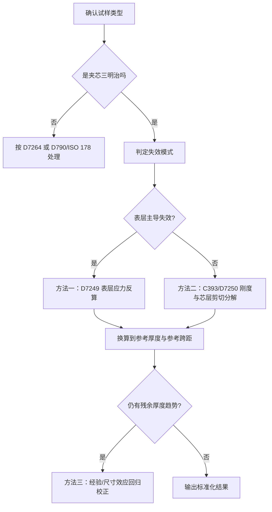

# 标准化三明治结构碳纤维增强材料弯曲测试结果的厚度校正方法研究

[English](../en/thickness-normalization-research.md) | [中文](thickness-normalization-research.md)

## 执行摘要

对于“纤维增强表层 + 夹芯芯材”的三明治结构，**不同最终成形厚度会显著改变用通用弯曲公式得到的表观弯曲强度与模量**。根本原因不是材料本体一定变了，而是：中性轴位置、表层到中性轴的力臂、芯层剪切变形占比、跨厚比、以及大挠度/机架柔度修正路径都会随厚度一起变化；因此，直接把 ASTM D790、ISO 178 或 ASTM D7264 的“名义弯曲应力/模量”当成可跨厚度直接比较的“材料常数”，在夹芯结构上往往会把几何效应和材料效应混在一起。ASTM D790 自身就明确指出：对高度各向异性的层合板，简单梁公式给出的只是基于均质梁假设的**apparent strength**，并且结果强烈依赖铺层；ASTM D7264 也明确指出弯曲性能会随试样厚度、受压面、环境和铺层而变化；ISO 178 也提醒其公式建立在线弹性、小挠度假设之上，并对模量测量要求柔度修正或直接挠度测量。

对这类材料，**最稳妥的厚度标准化思路不是继续用“实心矩形梁”名义应力去硬比**，而是把试验结果转换成更接近结构本征量的指标。就强度而言，最推荐的是按 ASTM D7249 的**表层极限应力**反算，因为它显式引入表层厚度、芯层厚度和支撑/加载跨距，能把“总厚度变化”转化为“同一表层材料在不同几何中的受力关系”；就刚度而言，最推荐的是按 ASTM D7250 的**等效弯曲刚度 $D$** 和**横向剪切刚度 $U$** 分解，再结合夹芯梁理论回算表层模量/芯层剪切模量，并重构到统一参考几何；如果只有历史峰值载荷和总厚度、却缺少表层厚度或应变数据，才退而采用幂律/Bažant 型尺寸效应回归做经验厚度修正。

本报告最终建议采用分层流程。**首选流程**是“D7249 表层应力标准化 + D7250 刚度分解”；**备选流程**是“夹芯梁简化模型 + 参考厚度重构”；**兜底流程**是“同一工艺族内的经验厚度回归”。如果必须在一个方法里给出最简、最可实施、且最能消除成形厚度差异的结果，建议最终报告把主指标设为：“表层极限应力 $\sigma_{f,u}$”“参考几何下的重构峰值载荷 $P_{u,\mathrm{ref}}$”和“参考几何下的重构刚度曲线”，而把 D790/ISO 178 风格的名义弯曲强度仅作为附录中的表观值保留。

## 问题背景与标准边界

三明治结构的典型构成是“两侧高模量表层 + 中间低密度芯层”。在弯曲下，表层主要承担拉压正应力，芯层主要承担面间距带来的剪切与稳定作用，因此这类结构的高比刚度/比强度，正来自“薄而强的表层”与“厚而轻的芯层”之间的几何耦合，而不是来自一个可用实心梁公式代表的均质截面。MIT 的夹芯梁讲义与 Allen 的经典著作都强调：夹芯梁的总挠度通常应分解为弯曲挠度与芯层剪切挠度，而且在典型夹芯中 $E_c \ll E_f$、$c \gg t$，因此厚度变化会同时改变弯曲臂长和剪切贡献。

用户关注的问题——“不同最终成形厚度导致弯曲强度/模量测量受影响”——在标准文本里其实有直接呼应。ISO 178 明确写到：不同尺寸或不同制样条件得到的结果未必可比，并特别指出对半结晶聚合物，取决于成型条件的表层取向层厚度也会影响弯曲性能；ASTM D7264 则明确指出弯曲性能会受到试样厚度、受压面、环境和应变速率影响，多个数据集比较时这些参数必须等效。对于三明治结构，ASTM D7249 进一步指出影响表层强度的因素包括表层厚度、芯格几何和表层平整度；D7250 还要求其刚度分解仅用于线性载荷—位移响应。

因此，标准边界应先划清。ASTM D790 与 ISO 178 的设计对象主要是未增强/增强塑料的三点弯曲名义性能；ASTM D7264 面向聚合物基连续纤维复合材料层合板；而**真正直接面向夹芯三明治的**是 ASTM D7249（表层性质）、ASTM C393/C393M（芯层剪切/芯—面粘接主导的梁弯曲）和 ASTM D7250/D7250M（由弯曲试验求夹芯梁弯曲刚度与剪切刚度）。ISO 14125虽然不是用户点名的核心标准，但它是纤维增强塑料复合材料的对应 ISO 标准，并明确说明自己是“基于 ISO 178、但扩展到 FRP 复合材料以及三点/四点弯曲”的体系，因此作为补充比较很有价值。

需要特别说明的是：ASTM/ISO 的完整标准文本多数是付费获取，本文在“官方摘要/目录页 + 公开预览/样张 + 学术原始文献/教材”基础上做比较；真正用于合规出具试验报告时，仍必须以实验室采购并声明版次的正式标准文本为准。

## 相关标准比较

下表关注的不是“哪个标准更权威”，而是“哪个标准更接近用户要解决的厚度偏差问题”。

| 标准 | 主要对象 | 典型加载 | 厚度/跨距核心规定 | 计算关注点 | 对厚度标准化的意义 |
|---|---|---|---|---|---|
| ASTM D790 | 未增强/增强塑料、部分高模量复合材料 | 三点弯曲 | 默认跨厚比 16:1；高各向异性层合板可增至 32:1、40:1，求模量时可到 60:1；试样厚度随材料类别而定 | 名义外纤维应力、应变、弯曲模量；大跨厚比/大挠度有修正式 | 适合给出**表观值**；不适合直接消除夹芯三明治的厚度偏差 |
| ISO 178 | 刚性/半刚性塑料 | 三点弯曲 | 首选试样 80×10×4 mm，首选 $L/h=16$；公式基于线弹性、小挠度；模量测量要求柔度修正或挠度计 | 名义弯曲应力、应变、模量 | 对塑料质量控制有用；对夹芯/FRP 表层结构并非首选 |
| ASTM D7264 | 聚合物基连续纤维复合材料层合板 | 三点或四点 | 标准跨厚比 32:1；标厚 4 mm、宽 13 mm；可用 16:1、20:1、40:1、60:1，但不同跨厚比数据不可直接互比 | 长梁强度、刚度、载荷—位移行为 | 比 D790 更适合 CFRP 层合板；但仍主要是**层合板**而非夹芯三明治 |
| ASTM D7249/D7249M | 夹芯结构的表层性质 | 长梁四点为主，也允许 $L=0$ 形式出现在公式中 | 经验上要求 $L/d>20$、$t/c<0.1$；公式显式引入表层厚度与芯层厚度 | **表层极限应力**、表层弦模量、夹芯弯曲刚度 | **强度标准化首选**，尤其适合“FRP 表层 + 夹芯芯材” |
| ASTM C393/C393M | 夹芯结构芯层剪切/芯—面粘接主导行为 | 梁弯曲 | 标准配置常为三点，也列出四点非标配置；结果与 D7250 联用 | 芯层剪切强度、芯—面粘接、载荷—位移 | 用于识别是否是**芯层/界面失效**而非表层失效 |
| ASTM D7250/D7250M | 夹芯梁弯曲与剪切刚度 | 基于 C393 / D7249 结果 | 通过两种加载工况或两种跨距联立 deflection equation；仅适用于线性载荷—位移区 | **弯曲刚度 $D$**、横向剪切刚度 $U$**、芯层剪切模量 $G_c$** | **模量/刚度标准化首选** |
| ISO 14125 | 纤维增强塑料复合材料 | 三点或四点 | 对不同材料类别给出不同跨厚比；FRP 尤其是碳纤维体系采用更大的外跨厚比，四点内跨为外跨的三分之一 | FRP 的弯曲强度与模量 | 可作为 ASTM D7264 的 ISO 侧补充参照 |

表中关于对象、范围、跨厚比、加载方式和“不可直接比较”之类的结论，依据 ASTM/ISO 官方摘要页、公开预览页及样张整理而来。ASTM D790 的表观性警告、ISO 178 的小挠度/柔度修正要求、ASTM D7264 的 32:1 长梁思想、ASTM D7249/D7250 对夹芯的针对性，是本问题最关键的区分点。

就用户场景而言，结论很明确：**若试样真的是夹芯三明治，而不是单纯实心 CFRP 层合板，D790/ISO 178/D7264 都只能给“某种表观弯曲表征”，不能天然消除厚度差异；要解耦厚度效应，应转向 D7249 + D7250 的夹芯框架。**

## 理论基础

### 弯曲力学与名义公式

对均质、线弹性、矩形截面的简支梁，三点弯曲下最大弯矩为 $M_{\max}=PL/4$，因此外纤维名义应力可写成
$$
\sigma = \frac{M c}{I}=\frac{3PL}{2bd^2}.
$$
这正是 ASTM D790 的名义应力表达式；其名义应变对应
$$
\varepsilon=\frac{6Dd}{L^2},
$$
弯曲模量则由初始斜率 $m$ 得
$$
E_B=\frac{L^3 m}{4 b d^3}.
$$
ASTM D790 还给出了大跨厚比、高挠度下的近似修正式。

但这套公式的成立前提，是“截面响应可由简单梁理论、均质截面假设、且剪切影响可忽略”来近似。ASTM D790 明确提出：对高度正交各向异性的层合板，最大应力不一定发生在外表面，若仍用简单梁公式，则得到的是基于均质梁理论的**表观强度**，且强烈依赖铺层顺序。ASTM D7264 也强调其计算基于梁理论，而实际试样在一般情况下更像板；对于含较多 $\pm45^\circ$ 铺层的层合板，这种差异可能明显。

### 层合板理论与厚度依赖

经典层合板理论把层合板的膜内力 $N$ 与弯矩 $M$ 和中面应变/曲率通过 $A$、$B$、$D$ 矩阵联系起来；其中 $D$ 矩阵对应弯曲刚度，若层合板关于中面对称，则 $B=0$，膜—弯耦合消失。也因此，**同样材料、不同总厚度/铺层分布**，会通过 $D$ 矩阵和中性轴分布改变弯曲响应。Jones 的经典教材、TU Delft 的 CLT 课程与开放讲义都把这点作为层合板弯曲分析的核心。

厚度效应在复合材料弯曲里并不只是“量纲归一化不充分”这么简单。Bažant 等对纤维复合层合板弯曲强度的尺寸效应研究指出，名义强度会随结构尺度出现系统性变化；对层合板与夹芯结构，这种变化常与准脆性断裂区、能量释放和统计尺寸效应有关，而不是纯粹的小样本波动。更近期的 Hu 等工作则直接以 CFRP 层板弯曲试验说明：弯曲强度的厚度依赖与铺层厚度相关，并提出了可回推出厚度无关“本征拉伸强度”的复合公式；他们还指出，对典型单层厚度约 120–130 μm 的 CFRP，ASTM D7264 推荐的 4 mm 级试样可以让厚度效应显著减弱。

### 夹芯梁理论与总厚度效应

夹芯梁最关键的区别是：总挠度不是单一的弯曲挠度，而是
$$
\Delta=\Delta_b+\Delta_s.
$$
MIT 夹芯梁讲义给出的形式与 ASTM D7250 的标准 deflection equation 是一致思想：前者把等效弯曲刚度 $(EI)_{eq}$ 与芯层剪切刚度 $(AG)_{eq}$ 分开，后者则以夹芯梁弯曲刚度 $D$ 和横向剪切刚度 $U$ 的形式写成
$$
\Delta = \frac{P(2S^3-3SL^2+L^3)}{96D}+\frac{P(S-L)}{4U}.
$$
对典型夹芯，若 $E_c\ll E_f$ 且 $c\gg t$，则等效弯曲刚度可近似写成
$$
D \approx \frac{E_f b t(c+t)^2}{2}+\frac{E_c b c^3}{12}
\approx \frac{E_f b t c^2}{2},
$$
说明**哪怕表层材料完全不变，只要表层厚度 $t$、芯层厚度 $c$ 或总厚度 $d=c+2t$ 变化，弯曲刚度就会显著变化**；同时，芯层剪切刚度不足时，模量表观值还会被低估。

对“FRP 表层 + 夹芯芯材”的强度，ASTM D7249 给出的表层极限应力公式在等厚表层 $t_1=t_2=t$ 时可简化为
$$
\sigma_{f,u}=\frac{P_{\max}(S-L)}{2(d+c)bt}.
$$
这意味着同一个表层极限应力 $\sigma_{f,u}$，在不同 $d,c,t,S,L$ 下会对应不同峰值载荷 $P_{\max}$。再把这个式子代回 D790 的三点名义应力公式，就能得到一个非常重要的结论：
$$
\sigma_{\mathrm{app}}=\frac{3PS}{2bd^2}
=\frac{3\sigma_{f,u}t(d+c)}{d^2}
\quad (L=0).
$$
若对称夹芯 $c=d-2t$，则
$$
\sigma_{\mathrm{app}}=\frac{6\sigma_{f,u}t(d-t)}{d^2}.
$$
也就是说，**即使表层真实极限应力根本没变，只要总厚度变了，用实心梁名义公式算出来的“弯曲强度”就会系统漂移。**这正是用户要消除的厚度偏差。以上关系是由 ASTM D7249 的表层应力式与 ASTM D790 的名义应力式直接联立而得。

## 厚度归一化方法评估

### 方法全景与适用性判断

| 方法 | 核心思想 | 代表公式/标准 | 优点 | 限制 | 适合本问题的程度 |
|---|---|---|---|---|---|
| 按截面模量归一化 | 把试样视为均质矩形梁，用 $M/Z$ 或 D790/ISO 178 名义应力 | D790, ISO 178 | 简单、历史数据常见 | 不能区分表层与芯层；会把厚度效应混进结果 | 低 |
| 按表层应力归一化 | 用 D7249 反算 FRP 表层真实拉/压应力 | D7249 Eq.4 | 直接面向夹芯表层失效；几何效应表达明确 | 需要表层厚度、芯层厚度；需确认失效确实在表层 | 很高 |
| 按等效弯曲刚度 $D$ / 剪切刚度 $U$ 归一化 | 把总挠度分解为弯曲+剪切；回算到参考几何 | D7250 + 夹芯梁理论 | 最适合模量/整条力—位移曲线标准化 | 需要更多输入；最好有两种加载工况/跨距或材料参数 | 很高 |
| 按面积/体积/质量比归一化 | 用比强度、比刚度或面密度归一化 | 结构轻量化评价常用 | 适合设计效率比较 | 不是“消除测试厚度偏差”的方法 | 中等偏低 |
| 幂律厚度修正 | 用 $y=a h^{-n}$ 或 $y=y_\infty+a h^{-n}$ | 经验回归 | 实施方便，可兼容历史库数据 | 高度依赖本工艺、本材料、本厚度区间 | 中等 |
| Bažant/尺寸效应修正 | 用准脆性尺寸效应律修正名义强度 | 尺寸效应文献 | 有较强断裂力学依据 | 需同一失效机制、足够厚度跨度和拟合质量 | 中等 |
| 有限元标定系数 | 用 FE 把实测几何换算到参考几何，再用校正系数闭环 | FE + 试验标定 | 适合复杂芯格、局部压痕、界面脱粘 | 建模成本高，便携性差 | 中高 |

表中“适合程度”的判断，基于 ASTM D7249/D7250 对夹芯表层与刚度分解的针对性、ASTM D790/D7264/ISO 178 的表观名义公式属性，以及尺寸效应文献对复合/夹芯结构厚度依赖的讨论。

### 对各类方法的具体评价

**截面模量归一化**本质上已经内嵌在 D790/ISO 178/D7264 的名义应力计算里；它对均质实体梁很有意义，对单一材料层合板也常够用，但对夹芯三明治并不充分。原因是夹芯结构的真正主承载层是表层而不是整个厚度均匀承担弯曲，芯层又会引入显著剪切变形，因此同一表层材料的“真实强度”会映射成不同的表观名义强度。ASTM D790 和 D7264 都明示层合板/复合材料会受厚度、铺层、跨厚比和剪切影响，因此这类方法最多只能作为“历史库的最低限度清洗”，不能作为最终标准化主方法。

**表层应力归一化**是本问题中最强的强度修正方法。只要试验的主失效模式是表层拉断、压碎或局部失稳而非芯层剪切/界面脱粘，就可以把峰值载荷换算成表层极限应力，再反算到统一参考厚度与跨距。这一步把“总厚度变化”显式写进公式，因此最直接地消除了成形厚度差异带来的几何放大/缩小效应。它的局限在于：必须知道 $t_1,t_2,c,d,S,L$，并且必须先判定失效模式属于表层主导。

**等效弯曲刚度 $D$ / 剪切刚度 $U$ 标准化**是模量/刚度问题的首选。与只看峰值载荷不同，这一方法能利用载荷—位移曲线的线性段，把结果拆成“几何放大的弯曲刚度”和“芯层剪切刚度”两部分，再回算表层模量 $E_f$ 与芯层剪切模量 $G_c$，最后把样品重构到统一参考几何。这种方法对“不同最终厚度但默认同配方/同铺层”的样品最有价值，因为它保留了夹芯结构真正的力学分工。其最大限制是：需要两种跨距/两种加载工况，或需要额外材料参数，且标准明确要求线性力—位移响应。

**幂律修正、Bažant 尺寸效应律和 Hu 的厚度效应模型**更适合作为“残差修正”或“历史数据库兼容层”，而不宜直接替代结构力学归一化。理由很简单：它们往往对同一工艺窗口、同一失效模式、同一厚度范围有效，一旦材料体系、铺层、芯格或失效机制变了，拟合系数很可能失效。Bažant 的尺寸效应框架强调复合/夹芯结构中的准脆性失效可引起系统尺寸效应；Hu 等则说明 CFRP 厚度效应与单层厚度有关，并且对典型 4 mm 级 D7264 试样厚度效应可被弱化。这些都说明经验/断裂回归有价值，但应建立在**先做结构归一化、再看是否仍有残差厚度趋势**的顺序上。

## 推荐标准化计算流程

### 推荐流程概览

这一路径与 ASTM 对夹芯结构“表层、芯层、刚度”分开处理的框架一致，也兼容 ISO/ASTM 对跨厚比、柔度修正和失效模式控制的要求。

### 方法一

**目标**是把受厚度影响的峰值载荷 $P_{\max}$ 转成更接近材料本征的表层极限应力 $\sigma_{f,u}$，再统一换算到参考厚度。对等厚表层、夹芯总厚度 $d=c+2t$ 的三明治梁，依据 D7249 的表层应力公式可写成
$$
\sigma_{f,u}=\frac{P_{\max}(S-L)}{2(d+c)bt},
$$
三点弯曲时 $L=0$。选定参考几何 $(d_{\mathrm{ref}},c_{\mathrm{ref}},t_{\mathrm{ref}},S_{\mathrm{ref}},L_{\mathrm{ref}})$ 后，可得
$$
P_{\max,\mathrm{ref}}=
\frac{2\sigma_{f,u}(d_{\mathrm{ref}}+c_{\mathrm{ref}})b_{\mathrm{ref}}t_{\mathrm{ref}}}
{S_{\mathrm{ref}}-L_{\mathrm{ref}}}.
$$
如果需要把旧数据里的 D790 表观强度也一起“纠偏”，对三点弯曲有
$$
\sigma_{\mathrm{app}}=
\frac{3PS}{2bd^2}
=
\frac{3\sigma_{f,u}t(d+c)}{d^2},
$$
这说明同样的 $\sigma_{f,u}$ 会因 $d$ 改变而映射成不同的 $\sigma_{\mathrm{app}}$。

这一方法需要的输入是：$b,d,t_1,t_2,c,S,L,P_{\max}$、失效模式判定、受压面/受拉面信息。若 $t_1,t_2$ 未提供，D7249 明确允许由试验委托方指定采用“测量厚度”或“名义厚度”；对二次粘接表层，宜在粘接前测量；对共固化表层，常按名义单层厚度乘层数计算。若 $c$ 未直接测量，可用 $c=d-t_1-t_2$ 求得。若受压/受拉两侧表层不等厚，应分别计算 $\sigma_{f1,u}$ 和 $\sigma_{f2,u}$。

误差来源主要有三类：表层厚度测量误差、局部压痕/滚动支承造成的实际跨距变化、以及失效模式误判。若试样先发生芯层剪切或芯—面脱粘，这个流程就不应作为主结果。D7249 和 C393 都把失效识别、跨距与表层/芯层失效模式区分视为关键。

### 方法二

**目标**是把力—位移曲线变成“与几何分离”的刚度参数，再重构到统一参考厚度。ASTM D7250 的通式为
$$
\Delta = \frac{P(2S^3-3SL^2+L^3)}{96D}+\frac{P(S-L)}{4U},
$$
其中 $D$ 为夹芯梁弯曲刚度，$U$ 为横向剪切刚度；芯层剪切模量则由
$$
G_c=\frac{U(d-2t)}{b(d-t)^2}
$$
得到。对对称、薄表层、弱芯层夹芯，夹芯梁理论可近似写成
$$
D \approx \frac{E_f b t(c+t)^2}{2}+\frac{E_c b c^3}{12},
\qquad
U \approx \frac{G_c b(d-t)^2}{d-2t}.
$$
从而得到 $E_f$、$G_c$ 后，再代入参考几何 $(d_{\mathrm{ref}},t_{\mathrm{ref}},c_{\mathrm{ref}})$ 计算 $D_{\mathrm{ref}}$、$U_{\mathrm{ref}}$，最后重构参考几何下的整条曲线：
$$
\Delta_{\mathrm{ref}}(P)=
\frac{P(2S_{\mathrm{ref}}^3-3S_{\mathrm{ref}}L_{\mathrm{ref}}^2+L_{\mathrm{ref}}^3)}{96D_{\mathrm{ref}}}
+\frac{P(S_{\mathrm{ref}}-L_{\mathrm{ref}})}{4U_{\mathrm{ref}}}.
$$

这一方法最适合两种情况。第一，实验上已经做了两种跨距、两种加载工况，或同一样品做了两次线性弯曲测试；第二，已有独立的表层模量/芯层模量/芯层剪切模量数据，希望把不同厚度样品重构到同一个参考厚度和参考跨距。D7250 正是为这类“由 deflection equation 反求 D 和 U”的场景建立的。

所需输入是：至少一段线性力—位移数据、$b,d,t,c,S,L$、以及一套能求出 $D,U$ 的附加信息。若 $E_f,E_c,G_c$ 未指定，可通过两种加载配置反求；若只做了一种加载配置而没有面层模量，严格说不足以唯一分离弯曲与剪切贡献。若设备只记录横梁位移而没有独立挠度计，则 ISO 178 要求模量测量必须做柔度修正或使用直接挠度测量；D790 允许报告横梁位移，但也要求说明测量方式，并指出两种测法会产生差异。

误差的主导项通常不是力值，而是挠度链路：机架柔度、支承滚动、初始就位、局部压痕、以及线性段选取。对厚度差异不大的样条，这些误差有时比“真实厚度效应”还大，因此建议在方法二里同时报告：原始曲线、线性段拟合区间、柔度修正方式，以及 $D,U,G_c$ 的区间估计。

### 方法三

当历史数据库里只有“总厚度 + 峰值载荷/表观强度”，而没有 $t_1,t_2,c$ 或挠度链路时，只能用经验厚度修正。最常见的是幂律：
$$
y(h)=a h^{-n}
\quad\text{或}\quad
y(h)=y_\infty+a h^{-n},
$$
把某个厚度 $h_i$ 的观测值换算到参考厚度 $h_{\mathrm{ref}}$ 时，使用
$$
y_{\mathrm{ref},i}=y_i\frac{f(h_{\mathrm{ref}})}{f(h_i)}.
$$
若怀疑主导机制是准脆性断裂/裂纹起裂，可用 Bazant 型尺寸效应式，例如
$$
\sigma_N(h)=\frac{B}{\sqrt{1+h/h_0}},
$$
再做同样的参考厚度换算。

但这一方法必须满足三个前提：同一工艺窗口、同一失效模式、同一跨厚比/环境/速率体系。否则，回归系数会把工艺差、速率差、湿热差和厚度差全部混成一个“伪厚度指数”。对复合材料层板，Hu 等的研究说明厚度效应与铺层单层厚度紧密相关；这也意味着经验修正不可跨材料体系生搬硬套。

如果把方法三作为正式报告的一部分，建议把它放在“残差模型”位置：先用方法一或方法二做结构力学校正，再检查归一化结果是否仍随厚度有系统斜率；只有残差仍显著时，才对残差再做幂律/Bažant 拟合。这比直接用回归替代结构分析更稳健。

## 示例计算与模板

### 数值示例

下面给一个**可复现的、只为说明公式效果的例子**。假设两组样品的表层材料完全相同，表层真实极限应力都为 $\sigma_{f,u}=420$ MPa，宽度 $b=25$ mm，表层厚度 $t=1$ mm，且都按三点弯曲、相同跨厚比 $S/d=20$ 试验。样品 A 总厚度 $d=12$ mm、芯层厚度 $c=10$ mm；样品 B 总厚度 $d=14$ mm、芯层厚度 $c=12$ mm。由 D7249 反推峰值载荷：
$$
P_{\max}= \frac{2\sigma_{f,u}(d+c)bt}{S}.
$$
于是 A 的 $P_{\max}=1925$ N，B 的 $P_{\max}=1950$ N；看起来峰值载荷几乎一样，但若用 D790 的名义应力公式计算，则 A 的表观弯曲强度约为 192.5 MPa，B 约为 167.1 MPa。也就是说，**真实表层强度相同，只因厚度不同，表观名义强度就下降了约 13%**。反过来，用 D7249 表层应力回算，两者都回到 420 MPa。这个例子正是“厚度偏差”与“材料真实变化”混淆的最简单体现。

| 样品 | $d$ mm | $c$ mm | $t$ mm | $S$ mm | $P_{\max}$ N | D790 表观强度 MPa | D7249 表层极限应力 MPa |
|---|---:|---:|---:|---:|---:|---:|---:|
| A | 12 | 10 | 1 | 240 | 1925 | 192.5 | 420 |
| B | 14 | 12 | 1 | 280 | 1950 | 167.1 | 420 |

表中的峰值载荷由 D7249 关系式反推，表观强度由 D790 名义应力式计算，因此它不是“实验测得”的真实材料差异，而是“同一真实表层强度映射到不同厚度几何后的表观差异”。

刚度方面，再假定两组样品共享同一表层模量 $E_f=70$ GPa、芯层弹性模量 $E_c=100$ MPa、芯层剪切模量 $G_c=40$ MPa，则由夹芯梁近似可得 A 的 $D\approx1.06\times10^8$ N·mm$^2$、$U\approx1.21\times10^4$ N；B 的 $D\approx1.48\times10^8$ N·mm$^2$、$U\approx1.41\times10^4$ N。厚样品的原始刚度更高，这是几何必然；但如果把 B 回算到 A 的参考几何，重构曲线就会与 A 收敛。故而**模量/刚度的厚度标准化，不应该直接比 $P/\Delta$，而应先解耦出 $D$ 与 $U$，再投影到统一参考几何。**

### 输入项与缺失数据处理

| 输入项 | 方法一是否需要 | 方法二是否需要 | 缺失时建议 |
|---|---|---|---|
| 总厚度 $d$、宽度 $b$ | 需要 | 需要 | 必测，至少三点取平均；这是所有方法的最低要求 |
| 表层厚度 $t_1,t_2$ | 强烈需要 | 强烈需要 | 二次粘接表层尽量在粘接前测；共固化可用名义单层厚度 × 层数，并做 ±5–10% 敏感性分析 |
| 芯层厚度 $c$ | 需要 | 需要 | 用 $c=d-t_1-t_2$ 计算；若表层实测误差大，需连带传播不确定度 |
| 支撑跨距 $S$、加载跨距 $L$ | 需要 | 需要 | 必须来自夹具实测值；不同跨厚比数据不能混比 |
| 峰值载荷 $P_{\max}$ | 需要 | 备选 | 若只有峰值载荷，至少可做方法一 |
| 力—位移曲线 | 建议 | 核心需要 | 无曲线就无法可靠分离 $D$ 和 $U$ |
| 表层/芯层材料参数 $E_f,E_c,G_c$ | 不一定 | 视流程而定 | 没有时应通过两种加载工况或外部试验反算；供应商数据只能做预估 |
| 失效模式 | 核心需要 | 核心需要 | 若主失效不是表层，应改用芯层/界面主导流程 |
| 机架柔度/挠度测量方式 | 建议 | 核心需要 | 模量分析时必须说明是否做柔度修正或使用挠度计 |

这一处理原则与 D7249 对表层厚度使用方式的说明、ISO 178 对模量测量柔度修正的要求，以及 D7250 对线性段 deflection equation 的依赖相一致。

### 模板文件

此前会话中生成的模板尚未纳入本仓库。后续补充时应统一放入 `tests/flexural/forms/templates/`，并使用以下稳定文件名：

- `sandwich_flexure_normalization_template.xlsx`
- `specimen_summary_template.csv`
- `raw_curve_template.csv`

模板中的 `Calc_Strength` 工作表对应方法一；`Calc_Stiffness` 对应方法二；`Empirical_Fit` 对应方法三；`Plot_Guide` 给出了推荐图的字段选择。

### 建议绘图

最少应画三类图。第一类是**力—位移曲线**，用于判断线性段、机架柔度影响和失效突变；第二类是**归一化前强度—厚度散点图**，横轴为总厚度，纵轴为 D790/D7264 风格的表观强度；第三类是**归一化后表层应力—厚度散点图**，横轴仍为总厚度，纵轴改为 D7249 反算的表层极限应力。若方法有效，第二类图往往带明显斜率，而第三类图应显著收敛。对刚度，还建议加画“参考几何重构曲线”与实测曲线的对照图。

## 有限元标定与实施建议

### 何时值得上有限元

当样品存在以下情况时，仅用解析公式常常不够：芯格不是连续均匀泡沫/木芯而是蜂窝、波纹、晶格等离散芯；表层不是薄面对称层，而是厚表层、局部补强或非对称铺层；加载头下存在明显压痕、局部屈曲、面芯脱粘、芯层压碎或多模式耦合；或者实验室确实需要把多个厚度规格“换算到同一参考几何后做工程放行”。这时 FE 标定能把局部接触、面芯界面和非均匀应力场纳入。夹芯弯曲的近年文献大多采取“实验 + 分析 + FE”联合框架，说明这是复杂三明治结构的常规手段，而不是过度设计。

### 建模步骤与边界条件

边界条件应首先与所声明标准严格一致：支撑跨度、加载跨度、加载头/支承头半径、是否四点加载、是否使用压力垫、是否滚动/可转动支承，都应与试验夹具一致。ASTM D7264、D7249、ISO 178 都对支承/加载鼻半径、跨距定义和挠度测量位置作出规定，因此 FE 里的加载头和支撑最好建成刚体解析面，半径、跨度和接触位置直接取自实测夹具参数；加载采用位移控制，输出反力—位移曲线与中跨挠度。

若目标是**几何校正而不是失效预测**，首轮模型可以从线弹性开始：表层用正交各向异性层合板属性，芯层用各向同性或正交各向异性实体，界面先设为完全粘结；用实测小挠度线性段标定 $E_f,G_c$ 或界面刚度。若目标还包括失效/峰值载荷，则可逐步引入 Hashin/Puck/Tsai-Wu 类表层失效判据、芯层压碎/剪切屈服模型，以及界面 cohesive zone 或接触脱粘。这里的模型复杂度应由实际失效模式决定，而不是一开始就全开。近期三点弯曲数值研究普遍用实验先识别主失效模式，再在 FE 中逐步加入对应损伤机理。

### 网格与材料模型建议

若结构几何较简单，常用做法是：表层用壳单元、芯层用实体单元，面芯界面用 tie/coupling 或 cohesive；若厚度方向应力、局部压痕或界面应力是重点，则表层与芯层都用实体单元更稳妥。近期 Abaqus 三点弯曲研究中，八节点减缩积分实体单元（如 C3D8R）是常见选择之一，并会做与实验的对比验证；但网格尺寸并没有统一“标准值”，应按加载头接触区、面芯界面和厚度方向应力梯度做局部加密，直到反力峰值和中跨挠度对网格不再敏感。

对材料模型，表层若已有 CLT/层合板信息，应优先输入单层工程常数与铺层，而不是直接给一个“等效各向同性面层”；芯层若是泡沫/蜂窝，应至少区分弹性剪切模量与压缩模量，不要只给一个 E 值。若缺乏芯层 $G_c$ 数据，恰恰可以用 D7250 或 FE 反求；这比盲用供应商宣传页上的“压缩模量”更接近弯曲场景。

### 最终推荐与不确定性评估

综合标准匹配度、物理意义、实施成本和对“厚度差异”的消除能力，本报告的最终推荐如下。**强度主指标**采用 ASTM D7249 框架下的表层极限应力 $\sigma_{f,u}$；**刚度主指标**采用 ASTM D7250 框架下的 $D$、$U$、$G_c$ 及参考几何重构曲线；**D790/ISO 178/D7264 名义值**仅作为补充的表观指标保留，用于与历史数据库兼容。若已有多厚度历史库但信息不全，再额外做经验厚度回归作为残差校正层，而不是作为主方法。

建议的实施步骤是：先统一记录几何与夹具参数；再按失效模式把样件分成“表层主导”“芯层/界面主导”两类；对前者做表层应力反算，对线性段做 $D/U$ 分解；然后把所有样件重构到同一参考厚度、同一跨厚比、同一加载配置；最后检查归一化结果是否仍残留厚度斜率，如有，再做经验回归修正，并把回归只限定在当前材料—工艺族内。

不确定性应至少从五个方面报告：几何测量不确定度，尤其是表层厚度；力/位移与机架柔度修正；失效模式识别是否一致；环境与应变速率是否等效；以及参考几何选取对结果的敏感性。经验上，对表层厚度未精确实测、而只用名义层厚时，建议至少做 ±5–10% 敏感性分析；对芯层 $G_c$ 未知而由反算得到时，建议给出参数区间而非单值。只有这样，厚度标准化后的结果才真正能区分“成形厚度差异”与“材料性能变化”。
